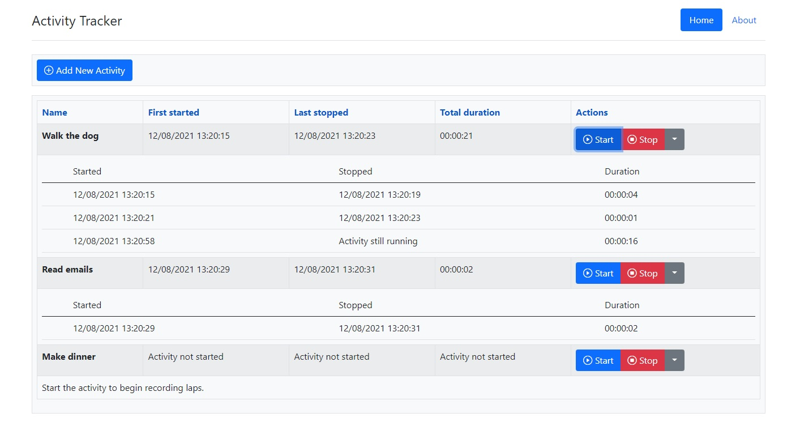

# ActivityTracker
Simple .NET 5 API and React.js UI to create, delete, start and stop activities

## Pre-requisites

### API
- [.NET 5](https://dotnet.microsoft.com/download/dotnet/5.0)
- [Visual Studio 2019](https://visualstudio.microsoft.com/downloads/)

### UI
- [Node.js (>= v14)](https://nodejs.org/en/download/)
- [Yarn](https://classic.yarnpkg.com/en/docs/install/#windows-stable)
- [Visual Studio Code](https://code.visualstudio.com/download)

## Running the app

### API
- Open and build the solution `src\api\ActivityTracker.sln` in Visual Studio 2019
- Ensure `ActivityTracker.Web.Api` is set as the Startup Project
- Press F5 to begin debugging, this should automatically open on URL `https://localhost:5001/` (if it doesn't then ensure it's not running in IIS)

### UI
- Open the folder `src\ui` in Visual Studio Code
- In a new terminal, run `yarn`. This should compile successfully. If any errors are present then most likely you are missing dependencies.
- Run `yarn start`, this should automatically open on URL `http://localhost:3000/`
- Now go ahead and enjoy the app!

## Testing

### API
- Simply run all tests in the solution using your favourite test explorer

### UI
- In a new terminal, run `yarn test a` to run all tests

## Improvements

### API
- Swap out in memory data store to a persistent store
- Authenticate requests and store activities by user
- Add complete code coverage for unit + functional tests
- Add regression test project to test actual instance of the API
- Add logging

### UI
- Add complete code coverage for unit + screen tests
- Add loading spinners to async API calls
- Improve start/stop buttons UX to enable/disable accordingly
- Improve error handling for uncaught API exceptions
- Implement Redux alongside actions/reducers/selectors
- Add pagination or scrolling for large lists
- Enable multiple selection to stop/start/delete activities
- Store API URL in config
